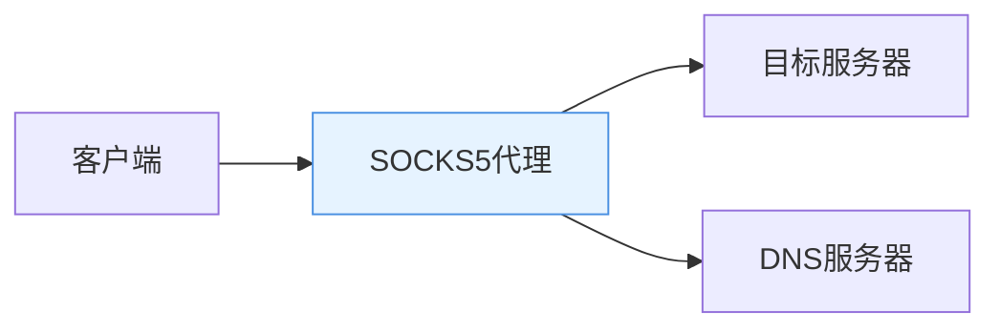
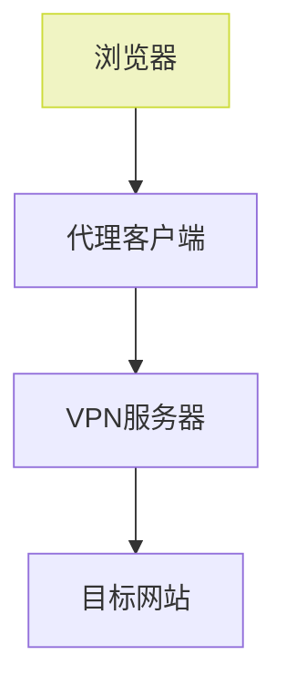
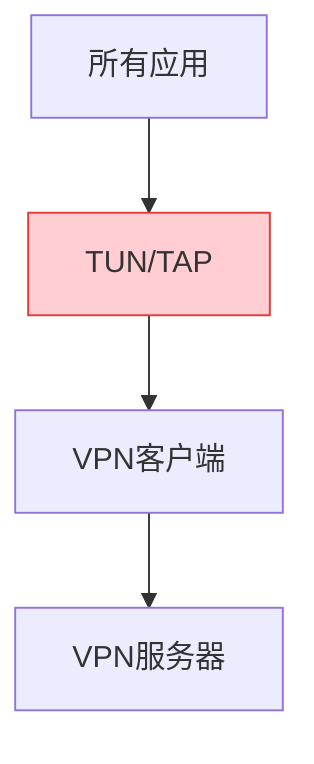
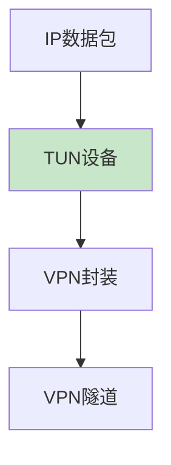

# Linux网络工具协议对比与代理模式解析

## 问题背景回顾

用户在使用VPN时发现：

*   浏览器可通过代理访问HTTPS网站
*   `ping`命令（ICMP协议）无法连通
*   `curl`需要显式指定代理参数才能工作
*   `wget`出现协议不支持错误

这引出了不同网络工具在协议支持上的差异问题。

***

## 常用Linux命令协议对比

| 命令/工具      | 默认协议 | 代理支持情况                  | 协议层级 |
| ---------- | ---- | ----------------------- | ---- |
| `ping`     | ICMP | 不支持任何代理                 | 网络层  |
| `curl`     | HTTP | 支持HTTP/SOCKS4/SOCKS5(h) | 应用层  |
| `wget`     | HTTP | 支持HTTP代理，有限SOCKS支持      | 应用层  |
| `telnet`   | TCP  | 不支持应用层代理                | 传输层  |
| `nslookup` | DNS  | 依赖系统DNS设置               | 应用层  |

***

## SOCKS5协议详解

### 核心特性



*   协议版本：比SOCKS4增加UDP支持和认证机制
*   端口协商：支持动态端口绑定（Port Binding）
*   地址类型：支持IPv4/IPv6/域名三种地址格式
*   DNS解析：
    *   socks5：客户端本地解析DNS
    *   socks5h：通过代理服务器解析DNS（防污染）

### 报文结构示例

```hex
+----+----------+----------+
|VER | NMETHODS | METHODS  |
+----+----------+----------+
| 05 |    01    | 00       |
+----+----------+----------+
|VER | CMD |RSV | ATYP | DST.ADDR | DST.PORT |
+----+-----+----+------+----------+----------+
| 05 | 01  | 00 |  01  | 7F000001 | 01BB     |
+----+-----+----+------+----------+----------+
```

## VPN代理模式层级差异

### 1. 应用层代理



### 2. 传输层代理（全局代理）



### 3. 网络层代理（TUN模式）



## 总结对比表

| 代理模式    | 协议层级 | 支持命令范围      | 典型VPN实现           |
| ------- | ---- | ----------- | ----------------- |
| 应用层代理   | 应用层  | 浏览器/支持代理的应用 | 浏览器插件、PAC         |
| 传输层全局代理 | 传输层  | 所有TCP/UDP应用 | SS/SSR全局模式        |
| TUN模式代理 | 网络层  | 全协议支持       | OpenVPN、WireGuard |

理解不同工具的网络协议实现差异和VPN代理的工作层级，能帮助我们更有效地诊断和解决网络连通性问题。实际使用中建议根据需求选择匹配的代理模式。