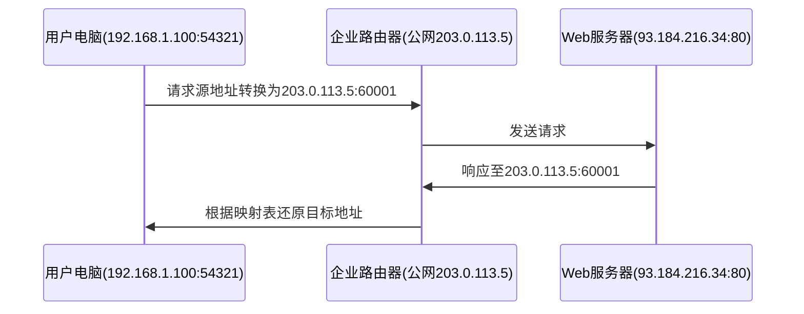

# 如何通过NAT技术实现内网访问外网——从数据返回答疑说起

## 一、什么是NAT？

**网络地址转换**（Network Address Translation，NAT）是解决IPv4地址枯竭问题的关键技术，核心功能是将私有IP地址与公有IP地址进行映射转换。在典型的办公网络环境中：

*   内部网络使用私有IP段（如192.168.0.0/24）
*   对外通信时统一使用企业公网IP
*   路由器/NAT设备维护动态映射表

## 二、数据返程的奥秘

### 访问外部网站时的完整流程

### 关键技术解析

*   动态映射表维护
    *   记录四元组：内部IP:端口 ↔ 公网IP:随机端口
    *   典型条目示例：192.168.1.100:54321 → 203.0.113.5:60001
*   端口重写机制
    *   通过PAT（Port Address Translation）技术
    *   支持65000+并发连接（每个端口号对应一个会话）

## 三、为什么必须使用NAT？

| 特性     | 传统网络 | NAT网络  |
| ------ | ---- | ------ |
| 公网IP消耗 | 1:1  | 1\:N   |
| 网络拓扑   | 完全暴露 | 隐藏内网结构 |
| 安全性    | 低    | 天然防火墙  |
| 管理难度   | 高    | 统一出口策略 |

## 四、NAT的局限与突破

*   值得注意的挑战：

    *   影响P2P类应用（如视频会议）
    *   增加网络延迟（平均增加3-5ms）
    *   会话状态维持（默认超时300-600秒）

*   现代解决方案：

    *   NAT穿透技术（STUN/TURN）
    *   IPv6过渡方案（NAT64/DNS64）
    *   应用层网关（ALG）支持

## 五、技术发展趋势

随着IPv6的普及，NAT技术正在发生演变：

1.  企业级NAT向CGN（运营商级NAT）延伸
2.  容器网络中的NAT新形态（如Docker网络模型）
3.  云原生环境下的智能NAT网关
4.  与SDN技术结合的动态策略控制

